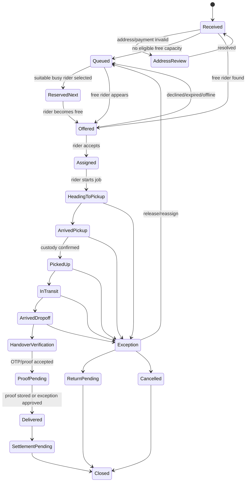

# ESDispatch End-to-End Product, Admin, Customer, Rider and Backend Audit

Audit date: 2026-09-09  
Workspace: `D:\Eng App`  
Operating assumption supplied by owner: ESDispatch operates only in Benin City.  
Audit type: source-code and flow audit of the current working tree. No production data was changed.

## 1. Executive Verdict

The app has many screens, labels and animations that make it look like a complete logistics platform, but its core operating truth is fragmented. The customer app, rider app, admin dashboard, Firestore rules and Cloud Functions do not share one authoritative delivery lifecycle. They disagree on what statuses mean, who may update them, how riders are selected, how money is settled, how OTP handover works, what city the company serves, and what a customer should see while waiting.

The practical result is exactly the type of pain described in the request: the admin dashboard makes it hard to make fast dispatch decisions, the queue is not first-come-first-served, rider assignment is clumsy, status changes can happen from the wrong places, and the customer experience says "assigning" or "live" without enough operational backing. The app is also full of impressive-sounding "AI", "precision", "optimization" and "live" language that often sits on top of defaults, fallback values, local simulations or incomplete data. That makes the system feel more intelligent than it is, which is dangerous for a delivery business.

The most serious problems are not cosmetic. The highest risks are:

1. Delivery and OTP data are broadly readable or mutable through Firestore rules.
2. Rider assignment has no reliable capacity, queue, preassignment or FIFO contract.
3. A production rider screen can transmit simulated movement and status progress as if it were real GPS.
4. Status changes are only partly guarded in the web UI and are not protected by one server-side lifecycle command.
5. Customer booking, tracking, admin dispatch and backend automation do not agree on Benin-only geography.
6. Proof of delivery, OTP verification and final settlement are in the wrong order and use conflicting logic.
7. Payment and payout calculations disagree across Android and Cloud Functions.
8. Admin activity logs, notifications, wallet adjustments and financial reports cannot be treated as reliable company records.
9. The dashboard popup does not provide enough detail or direct action to make a dispatch decision quickly.
10. The product includes many flows that look operational but are local-only, simulated, broad broadcasts, or not connected to the backend authority that would make them real.

The system needs a single delivery operating model before more UI polish is added. A beautiful dashboard will still fail if the underlying order can be assigned to a busy rider, marked delivered without proof, paid twice, shown to the wrong customer, or left pending forever because no rider was online at creation time.

## 2. Audit Scope and Evidence Limits

This audit reviewed the current working tree, including existing uncommitted changes. It did not assume that the deployed web app, Android APK, Firebase rules or Cloud Functions match the local source. It also did not modify application code.

The admin web code currently compiles with `npx --no-install tsc --noEmit --incremental false`. That only proves TypeScript accepts the current web source. It does not prove the dashboard works well, that deployed Vercel is current, or that Firebase operations succeed at runtime.

Physical Android installation and real-device walkthrough were not completed in this pass. The configured ADB path in the project instructions was unavailable, and the alternate Android SDK path hit a local Android home permission issue. The findings for mobile are therefore source-backed rather than device-walkthrough claims.

Browser-based admin walkthrough was also unavailable. A browser-control attempt was blocked by the app's automatic approval review because the account hit a Codex usage limit. The report therefore avoids pretending that the admin screens were clicked through visually. Where a finding concerns source behavior, it is marked as source-confirmed. Where runtime interaction would further prove layout or clipping behavior, the report calls that out as a high-confidence source risk rather than visual proof.

Official platform references used for technical interpretation:

- React documentation on accidental state reset when component functions are nested: https://react.dev/learn/preserving-and-resetting-state
- Firebase documentation on Firestore transaction ordering: https://firebase.google.com/docs/firestore/manage-data/transactions
- Firebase documentation on Firestore trigger delivery behavior: https://firebase.google.com/docs/functions/firestore-events

## 3. Source Key

Important files referenced throughout:

- Admin dashboard: `src/app/engdadmin/AdminDashboard.tsx`
- Web app shell/routes: `src/App.tsx`
- Firebase Functions: `functions/src/index.ts`
- Firestore rules: `firestore.rules`
- Storage rules: `storage.rules`
- Android delivery model: `mobile/app/src/main/java/com/esdispatch/data/Models.kt`
- Android Firebase manager: `mobile/app/src/main/java/com/esdispatch/data/FirebaseManager.kt`
- Android delivery view model: `mobile/app/src/main/java/com/esdispatch/viewmodel/DeliveryViewModel.kt`
- Android customer tracking screen: `mobile/app/src/main/java/com/esdispatch/ui/screens/TrackingScreen.kt`
- Android rider screen: `mobile/app/src/main/java/com/esdispatch/ui/screens/RiderScreens.kt`
- Android proof-of-delivery screen: `mobile/app/src/main/java/com/esdispatch/ui/screens/ProofOfDeliveryScreen.kt`
- Android FCM service: `mobile/app/src/main/java/com/esdispatch/data/MyFirebaseMessagingService.kt`
- Public marketing/site data: `src/data.ts`, `src/components/WhatsAppChat.tsx`

Severity labels:

- P0: exposes money, private data, delivery integrity or proof integrity.
- P1: breaks a core operational, customer, admin or rider flow.
- P2: creates major friction, misleading states, reporting errors or maintenance risk.
- P3: polish, wording or organization problems that still matter but do not block core dispatch alone.

## 4. What Is Already Better Than It Looks

This is a brutal audit, but a fair one. The code is not empty. Several foundations exist and should be preserved:

- The admin dashboard has real Firestore listeners and a sizeable delivery management table.
- The normal web status picker already attempts to prevent moving into `ASSIGNED`, `TRANSIT` or `OUT_FOR_DELIVERY` without a rider (`AdminDashboard.tsx:1882-1897`). This is partial and bypassable, but it is real.
- The rider self-claim path uses a transaction that rereads the target order and checks pending status and online state (`FirebaseManager.kt:1546-1557`). It does not lock rider capacity, but it is a useful start.
- The Android code includes real location service infrastructure (`LocationService.kt:25-78`) as well as the problematic simulator.
- OTP expiry and attempt fields exist in some paths, although verification is split and incomplete.
- Admin routing now uses `/engdadmin` as the primary route in the Vite app, with `/engadmin` redirecting there (`src/App.tsx`).
- There is an address database with Benin City entries. The problem is that unresolved addresses still become invented coordinates.

The repair should build on these working pieces. The main job is to stop five different parts of the app from inventing their own version of delivery truth.

## 5. The Core Delivery Flow the Product Needs

The app should not rely on one loose `status` string to represent every business fact. A delivery has at least four separate dimensions:

1. Payment state: quoted, payment pending, paid/reserved, cash to collect, refunded, settlement pending.
2. Dispatch allocation: received, queued, offered, accepted, reserved next, active with rider, released, reassigned.
3. Physical fulfilment: pickup not started, rider heading to pickup, arrived at pickup, picked up, in transit, arrived at drop-off, handover verified, delivered.
4. Exception state: no rider, address unresolved, sender unavailable, recipient unavailable, rider breakdown, damaged item, wrong address, return pending, cancelled, dispute.

Recommended operating model:

1. Customer submits a Benin City delivery request with verified pickup, verified drop-off, contact roles, package details and payment method.
2. Server records `receivedAt`, validates service area and either accepts the request or routes it to address/payment review.
3. If no rider is free, customer sees "Queued - request received" with honest queue position or service window. Admin sees the order sorted by oldest eligible request first.
4. If a rider is busy but suitable, admin/system may reserve the rider's next slot. Customer sees "Rider reserved - starts after current delivery" rather than "rider on the way".
5. When the rider finishes the current mission, the next reserved order becomes ready. The rider must acknowledge/start it; the customer should only see "heading to pickup" after that start event.
6. Rider confirms pickup with real custody proof: package count, condition, sender contact, pickup timestamp and optional photo/signature when required.
7. Real hardware GPS updates only location. It never auto-completes delivery stages by itself.
8. Rider arrives at drop-off and verifies handover through a server-owned challenge or approved exception. OTP must not be readable by the rider or public tracking document.
9. Proof of delivery is stored or an approved proof exception is logged before final delivered state.
10. One server-owned settlement command creates one rider/vendor/company ledger result.
11. Exceptions have owners and timers: waiting at pickup, recipient unreachable, wrong address, return to sender, rider breakdown, reassignment, refund review.

This gives the admin a dispatch cockpit instead of a status editor.

## 6. Ideal State Model

This does not mean the UI needs to show all of these as a long dropdown. The admin should see one simple next action, but the data model must carry enough truth to prevent lying to customers and dispatchers.

## 7. Admin Dashboard: Decision-Making Is Too Slow and Too Thin

### ADM-01 - P1 - The dashboard popup does not contain enough information to dispatch from it

The dashboard category inspection popup maps `inspectingCategory.deliveries` and shows a compact card with item, short ID, status, sender to recipient/drop-off summary, courier phone and price (`AdminDashboard.tsx:558-621`). The only operational button is `Manage`, which closes the popup, stores a search prefill and switches to the Shipments tab (`AdminDashboard.tsx:597-602`). The footer explicitly tells the admin to use Delivery Management for tracking, OTP, reassignment and status controls (`AdminDashboard.tsx:612`).

That means the popup is not a dispatch tool. It is a detour. For a dispatcher trying to clear a live queue, it omits:

- request time and waiting age;
- FIFO position;
- pickup address detail;
- receiver phone and sender phone as actions;
- payment state;
- service level;
- rider availability and load;
- address confidence;
- reason blocked;
- package constraints;
- rider selection;
- next legal status action;
- customer-visible state.

The owner example is correct: a dispatcher cannot make a fast decision from this popup. The current UI forces context-switching at exactly the point where the admin should be deciding.

Required behavior: the popup should become an order drawer or mini-dispatch workspace. For each request it should show full pickup/drop-off, all verified contacts, payment, queue age, available/reserved riders, current blocker, and the one or two legal actions. Admin should be able to assign, reserve, queue, call, message, change status, mark exception, and open full details without losing context.

Acceptance test: click Active Requests, pick the oldest pending request, assign or queue it from the same drawer, and confirm the order updates without needing to search for it again in the table.

### ADM-02 - P1 - The popup snapshot can become stale while the label says "real-time"

The popup stores the entire category object in React state (`AdminDashboard.tsx:391`) and opens it with `setInspectingCategory(a)` (`AdminDashboard.tsx:506`). It then renders that stored category's delivery list (`AdminDashboard.tsx:575`). If deliveries update after the popup opens, the stored object can remain stale unless the popup is rederived from current dashboard data. The header says "real-time category manifest" (`AdminDashboard.tsx:568`), but the data path does not guarantee that exact behavior.

Operational impact: a dispatcher could open a list, another admin or rider changes a status, and the modal still presents stale choices. For dispatch, stale choices are not just a UI inconvenience. They cause double assignment, wrong calls and failed status updates.

Required behavior: store a category key, not a category object. Recompute the displayed category from the latest delivery list each render and mark each row with last update time.

### ADM-03 - P1 - Dashboard categories are not FIFO and do not carry created time

The web deliveries subscription reads the `deliveries` collection without an `orderBy` and maps fields into a local object (`AdminDashboard.tsx:1009-1058`). The mapping omits several fields needed for dispatch order, including reliable server `createdAt`, `updatedAt`, payment status and fee breakdown. Dashboard "today" delivery grouping relies on text date checks and `.slice(-10).reverse()` rather than an explicit oldest eligible queue.

Operational impact: a later order can appear above an older one. A dispatcher trying to work fairly cannot see who has waited longest. The app cannot truthfully tell customers their queue position.

Required behavior: the dispatch queue must sort by server `receivedAt` or `acceptedAt`, then priority/service level, then eligibility. Manual override must require a reason. "Recent" can exist as a secondary lens, but live dispatch must be FIFO by default.

### ADM-04 - P1 - The Active Request metrics hide the exact backlog

Dashboard category cards read `a.pending` for an unassigned badge (`AdminDashboard.tsx:519-521`), but the category data object shown in the source does not define `pending` (`AdminDashboard.tsx:1290-1313`). Because the object is effectively `any`, TypeScript does not catch it. The result is that a useful unassigned badge may never appear even when pending requests exist.

Impact: the dashboard looks more complete than it is. Admins need to know unassigned work immediately, especially when capacity is constrained.

Required behavior: the dashboard should show counts for received, queued, assigned, active, exception, delivered today, cancelled today and overdue. Each count should open a correctly filtered queue sorted by age.

### ADM-05 - P1 - Search handoff from popup is brittle and can erase itself

The popup's `Manage` action stores `d.id` and switches to `shipments` (`AdminDashboard.tsx:597-602`). ShipmentsTab has an effect that receives the prefill and then clears the parent prefill. Because ShipmentsTab is defined as a nested component inside `AdminDashboardPage`, parent updates can remount it. React's own documentation warns that nested component functions can reset state because a different component function identity is created on each render. In this code shape, the prefill search is at risk of being immediately lost as the parent updates.

There is also a direct search mismatch: the global shipment search compares `d.id.includes(q)` without lowercasing the ID while the query is lowercased (`AdminDashboard.tsx:1858-1859`). Mixed-case IDs can fail exact handoff.

Impact: the admin clicks Manage and still has to hunt for the order. This is the frustrating behavior the owner described.

Required behavior: the dashboard should navigate to a route or select an order ID, not rely on a fragile local search. The target order should open directly in a drawer, with the table filtered only as a convenience.

### ADM-06 - P1 - Nested tab components reset local UI state on live updates

`AdminDashboardPage` defines major tab components inside itself: `UsersTab`, `ShipmentsTab`, support, marketplace, settings and others. Parent state changes from live Firestore listeners can recreate those component functions and reset their internal `useState` values. React documents this as a state preservation problem for nested component definitions.

Impact: live GPS updates, new orders or notification changes can reset filters, open forms, modal choices or text replies. That makes admin work feel slippery. An operator can start replying to support or filtering shipments, then the interface jumps or loses context after a background update.

Required behavior: move tab components to module scope or separate files. Keep selected order, filters and drafts in stable state keyed by route/order ID. Live updates should refresh data, not reset the workspace.

### ADM-07 - P0 - Admin assignment is a blind write, not a dispatch reservation

Single assignment updates a delivery directly with `riderId`, `driverId`, `courierName`, `courierPhone`, `riderBikeNumber`, `status: ASSIGNED` and timestamp (`AdminDashboard.tsx:1943-1948`). It does not atomically reserve rider capacity, check current order version, check current status, confirm rider availability, require rider acknowledgement, set assignment state, or snapshot verified rider photo/vehicle identity.

Impact: two admins can assign the same order; a busy/offline/suspended rider can be selected; customer can see an assigned rider who is not actually ready; rider may not know or accept the job.

Required behavior: assignment should be a server command. The command should check order version, stage, rider availability, active/reserved capacity, current location freshness, vehicle capability, rider status, and permission. It should return either `queued`, `reservedNext`, `offered`, `assigned`, or a clear conflict.

### ADM-08 - P0 - Reassignment overwrites identity without a custody protocol

Reassignment replaces rider identity fields (`AdminDashboard.tsx:1972-1977`) but does not handle whether the old rider accepted, picked up, is in transit, has proof, has OTP attempts, or has possession of the parcel. Bulk assignment can also write selected deliveries to `ASSIGNED` (`AdminDashboard.tsx:2058-2089`) without a per-order custody state machine.

Impact: after pickup, reassignment is not just a new name. It is a chain-of-custody event. Without that protocol, the company cannot prove who had the package, whether handoff occurred, or why the customer now sees a different rider.

Required behavior: before pickup, reassignment can release a reservation/offer with reason. After pickup, reassignment must create a custody transfer requiring both riders or dispatcher override, proof, location, time, and customer-visible explanation.

### ADM-09 - P1 - The status dropdown often shows blank for real current statuses

The custom select renders a placeholder if the current value is not present in the options list (`AdminDashboard.tsx:226-230`). The delivery status option builder often only includes the next legal step and terminal options (`AdminDashboard.tsx:2366-2380`). For an assigned delivery, the list may omit `ASSIGNED` even while the current value is `ASSIGNED`; for `TRANSIT`, it may omit `TRANSIT`; for `DELIVERED` or `CANCELLED`, only `PENDING` may be present. The visible control can therefore show "Select..." while the row already has a status.

Impact: this is a dispatch confidence killer. The admin sees a blank dropdown and cannot tell whether the order is malformed, selectable, or already in a state.

Required behavior: always include the current state as a disabled/read-only option at the top, then show legal next actions. Label terminal states clearly and remove invalid backward actions.

### ADM-10 - P1 - Admin can still cancel or complete malformed orders too easily

The normal web picker does have a partial rider requirement for `ASSIGNED`, `TRANSIT` and `OUT_FOR_DELIVERY`, but `DELIVERED` is not included in that `requiresRider` check. The guard runs against local row data before confirmation and the write does not re-read the order or use a transaction (`AdminDashboard.tsx:1903-1908`). Bulk cancellation has an early allowed branch and no cancellation reason/refund/customer-contact workflow.

Impact: UI checks help, but they do not enforce company policy. A stale screen can write an invalid final state. Cancellation can become a blunt status change instead of a business process.

Required behavior: all status changes should be server commands with expected current state, actor, reason and evidence. Delivered requires assigned/active rider, handover verification, proof state and payment settlement handling. Cancelled requires reason, actor, refund policy, package custody and customer communication.

### ADM-11 - P1 - Rider availability shown to admin is not enough to choose safely

Filtered drivers are computed from riders and current deliveries (`AdminDashboard.tsx:1840-1853`), but default filtering can include offline riders. Active load excludes some stages such as `ARRIVED`, and the UI can still show busy riders as options. Rider cards do not provide enough dispatch facts: fresh GPS time, current job ETA, capacity, vehicle type, package constraints, phone reachability, battery, acceptance rate, last completed job, break/shift state, suspension, or whether the rider is reserved for a next job.

Impact: the admin is asked to make a dispatch decision with decorative rider information instead of operational readiness.

Required behavior: rider selector should rank only eligible riders by verified availability and suitability. Busy riders should be shown under "Reserve next" with their current mission and estimated release time. Ineligible riders should explain why.

### ADM-12 - P1 - The table hides crucial fields on smaller screens

The shipments table hides rider and recipient columns on smaller breakpoints (`AdminDashboard.tsx:2285-2330`). Assignment exists in the details modal, so this is not impossible to do, but the main operational view becomes too thin on laptop/tablet widths. The dispatcher must drill into rows to see the exact facts needed for a decision.

Impact: a real dispatcher using a smaller screen will spend too much time opening and closing rows.

Required behavior: convert the shipment table to a queue layout with expandable rows or a persistent side drawer. Keep queue age, pickup area, drop-off area, rider state, payment and next action visible at all sizes.

### ADM-13 - P0 - Manual delivery creation creates disconnected and weak orders

The manual delivery form validation only checks that sender name, receiver name, pickup address and delivery address are non-empty (`AdminDashboard.tsx:2093-2129`). It can create an order with no phone numbers, no verified customer, no coordinates, no payment state, no server price validation, default price, random four-digit OTP and `userId: ""`. It creates a document and then performs a second update to set the ID, which is not atomic.

Impact: an admin-created delivery may not appear correctly for a real customer, may not notify the right person, may not have valid handover, and may not be price/payment/account linked.

Required behavior: manual orders must still use the canonical server creation path. Admin can create on behalf of a customer, but must choose or create a customer, validate contacts, verify Benin addresses, quote price, record payment method, and produce an auditable order in one transaction.

### ADM-14 - P1 - Dashboard loading and connection status can lie

The admin sets connected state from one listener path, while order listener errors are mostly console-only (`AdminDashboard.tsx:997-1058`). Settings errors are swallowed in some paths. Empty lists, load failures and permission failures can all look similar.

Impact: dispatchers may believe the queue is empty when it is actually not loaded. That is a direct operations risk.

Required behavior: show independent health indicators for deliveries, users/riders, settings, notifications and functions. "No requests" should only appear after a successful delivery listener snapshot.

### ADM-15 - P2 - Dashboard clutter buries urgent dispatch work

The dashboard includes a prominent marketplace kill switch and sample seeding controls near the top (`AdminDashboard.tsx:414-484`). Demo/sample creation functions exist in the production admin code path. Marketplace and content controls appear alongside urgent dispatch panels.

Impact: urgent operations compete visually with back-office settings. A dispatcher should not have to scan around marketplace controls while active requests wait.

Required behavior: split the admin into clear workspaces: Dispatch, Riders, Customers, Finance, Support, Marketplace, Settings, Logs. The Dispatch workspace should open by default for dispatcher roles and show only dispatch-relevant controls.

## 8. Admin Finance, Wallet and Audit Integrity

### FIN-01 - P0 - Revenue numbers are not financially trustworthy

Admin `totalRevenue` sums delivery `price` across all orders, including pending and cancelled ones (`AdminDashboard.tsx:1245`). Tips are also summed without settlement/payment context. Marketplace revenue and delivery revenue are mixed in different places. The shipments card labels gross order price as revenue.

Impact: the company cannot use dashboard revenue as cash collected, service fee earned, rider payable, vendor payable, wallet liability or profit. A cancelled unpaid order can inflate revenue.

Required behavior: separate booked amount, paid amount, delivery fee revenue, marketplace GMV, vendor liability, rider payable, tips, refunds, wallet balance liability and company margin. Every figure needs a time range and a ledger source.

### FIN-02 - P0 - Wallet adjustments can create actual negative balances while logging a clamped value

Admin wallet adjustment calculates a clamped `newBal`, but the actual Firestore write increments by `delta` (`AdminDashboard.tsx:1406-1463`). If `delta` is negative enough, the real balance can go below zero while the log reports zero. It writes wallet, subtransaction and root transaction through separate operations, so partial failure or retry can duplicate or misrepresent the adjustment.

Impact: customer wallet balances, logs and transaction history can disagree. Finance cannot reconcile trustfully.

Required behavior: wallet adjustments must be server-side ledger commands with expected current balance, reason, actor, customer notification policy and idempotency key. Negative outcomes must be intentional and visible if allowed.

### FIN-03 - P0 - Payment top-up exists as a server callable but the app does not consistently use it

Android wallet top-up paths call client wallet update functions rather than the server `verifyPaymentAndTopUp` flow in the traced paths. Firestore rules deny normal positive wallet updates, so payment success and wallet credit can drift apart.

Impact: a customer can complete payment and still not receive wallet credit, or the app can be tempted to loosen rules in a way that opens money writes.

Required behavior: all payment methods create a server-side payment intent, verify gateway reference, derive amount from gateway response, bind payment to UID and credit once.

### FIN-04 - P0 - Server payment verifier trusts caller amount too much

The backend verifier accepts `amount` and `reference`, checks gateway success, then credits the caller-supplied amount to the caller UID. It does not bind the reference to an expected payment intent, amount, currency or customer metadata (`functions/src/index.ts:289-357`).

Impact: gateway success alone is not enough accounting proof. The system must verify that this specific user paid this specific amount for this specific wallet/order.

Required behavior: server derives amount and currency from Paystack response and compares against a pending payment intent. The client cannot choose the credited amount.

### FIN-05 - P0 - Delivery settlement is non-idempotent and formula-inconsistent

Android completion calculates rider payout as 80 percent of `price`; Cloud Functions calculates 70 percent of `deliveryFee` plus tip with fallback delivery fees (`FirebaseManager.kt:1771-1794`, `functions/src/index.ts:213-224`). Proof-of-delivery code can also mark delivered again. Functions can process Firestore triggers more than once, and the settlement path increments balances without a complete idempotent guard.

Impact: a rider may be underpaid, overpaid, not paid, or paid twice depending on which path ran. Company finance will not reconcile.

Required behavior: one server-owned settlement ledger. The payout formula must be defined once, stored as an immutable snapshot and posted once per final completion event.

### FIN-06 - P1 - Admin activity logs are not a reliable audit trail

Web `addLog` writes an activity log but catches failure and still prepends a local row (`AdminDashboard.tsx:967-973`). Firestore rules allow admins to update and delete audit records. Logs are client-authored rather than generated by the server command that actually changed the business state.

Impact: an admin can see a success-looking local log that never persisted, and privileged actors can alter logs. That is not a secure company audit trail.

Required behavior: server commands create immutable audit events with actor, capability, target, before state, after state, reason, correlation ID and outcome.

## 9. Admin Support and Notifications

### SUP-01 - P1 - Support conversation selection can jump while admin is working

SupportTab auto-selects the first ticket from a listener effect. Because the tab is nested and because the effect captures earlier state, live updates can change the selected ticket while an admin is reading or replying (`AdminDashboard.tsx:4451-4533`).

Impact: support agents may reply to the wrong ticket or lose their place.

Required behavior: selection should be stable by ticket ID. New-ticket highlighting should not steal focus from an active conversation.

### SUP-02 - P1 - Support replies have weak accountability

Admin replies are written as `ADMIN_HQ` / `HQDispatcher` rather than a specific admin identity (`AdminDashboard.tsx:4518-4520`). Error handling clears reply text before the send completes and does not restore it on failure.

Impact: customers see generic replies, management cannot audit who said what, and failed sends can lose typed text.

Required behavior: replies must include actual admin UID/display name/role, preserve draft until persisted, and link support tickets to order IDs where relevant.

### SUP-03 - P1 - Notification writers and schemas disagree

The web admin creates a root notification and fans it out to every active user (`AdminDashboard.tsx:939-958`). Backend `onNotificationCreated` can fan that root notification out again. Android reads `message` and `isRead`, while web/backend often write `description` and `read`. Android status writers attempt direct user notification writes that rules deny for non-admins.

Impact: customers can receive duplicate, title-only or missing notifications. Operational notices can be broadcast to the wrong audience.

Required behavior: one notification service with typed audience, deterministic event ID, shared schema and delivery result. Customers receive customer events; admins receive operational events; riders receive assigned work events.

### SUP-04 - P1 - Push payloads can duplicate alerts and lose deep links

`MyFirebaseMessagingService` processes data payload and notification payload separately, showing notifications for both (`MyFirebaseMessagingService.kt:39-55`). It uses a constant pending intent request code `0` with `FLAG_UPDATE_CURRENT` (`MyFirebaseMessagingService.kt:106-110`), so multiple notifications can all open the most recent parcel context. Assignment push uses `deliveryId` in some backend paths while Android expects `parcelId`.

Impact: the user taps a notification and lands in the wrong context, or sees duplicate local alerts with different content.

Required behavior: normalize payload envelope and render once. Every notification should deep-link to exact order and next action.

## 10. Customer Booking Experience

### CUS-01 - P1 - Customer booking can say confirmed before the cloud order is safely persisted

`confirmBooking` debits wallet, creates local parcel, local transaction and notification, saves local data, then launches asynchronous sync to Firestore (`DeliveryViewModel.kt:4036-4166`). The callback returns "Booking confirmed" after the wallet debit and local creation path, not after every server-side order record, ledger and notification is safely complete.

Impact: the customer can see a confirmed order that dispatchers cannot see or cannot process. The company has money movement and local UI state before canonical delivery persistence is proven.

Required behavior: booking confirmation should depend on a server order creation command. Local offline draft is fine, but customer copy must distinguish "saved locally/pending sync" from "request received by ESDispatch".

### CUS-02 - P0 - Customer booking creates a client-side OTP secret

The Android booking model creates `otpCode = (1000..9999).random().toString()` (`DeliveryViewModel.kt:4068`) and stores it on the parcel. The parcel model contains `otpCode` (`Models.kt:40`). Firestore public delivery read rules expose delivery documents in backend findings.

Impact: OTP cannot be trusted as proof of recipient handover if it is stored in broadly readable client documents and loaded by rider/customer clients.

Required behavior: OTP/handover challenge must be generated, stored and verified server-side. The rider should never receive the secret value.

### CUS-03 - P1 - Address validation accepts weak text and then invents coordinates

Address validation and distance estimation can fall back to hash-generated coordinates around Benin City (`DeliveryViewModel.kt:3740-3803`). `isIntercityRoute` always returns false (`DeliveryViewModel.kt:3752-3755`). This means unresolved addresses become plausible coordinates instead of an address-resolution task.

Impact: a user can enter a vague or misspelled destination and get a price/route that looks precise. Admin and rider may later discover the address is not actually serviceable.

Required behavior: unresolved address should block dispatch or enter address review. Customer should confirm pin, landmark, entrance/contact and service zone.

### CUS-04 - P1 - Benin-only operation is contradicted by customer copy and old Lagos flows

The code now includes many Benin entries, but also defaults and copy for Lagos, Abuja, Asaba and interstate service. Examples include Lagos defaults in `DeliveryViewModel.kt:1438-1441`, AI fallback addresses in Lagos (`DeliveryViewModel.kt:4806-4822`), customer booking screens with Lagos map text and Lagos landmarks, public site data advertising Lagos/Abuja/interstate rentals (`src/data.ts`) and WhatsApp locations for Benin/Asaba/Lagos (`src/components/WhatsAppChat.tsx`).

Impact: customers and staff cannot tell whether the dispatch product is Benin-only, a multi-city courier product, or a separate car rental site. That ambiguity affects pricing, rider selection, service area, support promises and customer trust.

Required behavior: define product boundaries. If car rental is multi-city but dispatch is Benin-only, separate the wording and workflows. Dispatch booking should block or review non-Benin endpoints.

### CUS-05 - P1 - Marketplace checkout mixes store order, dispatch order and wallet mutation in one fragile client transaction

Marketplace checkout uses a transaction that updates product stock, then reads the user and store documents later inside the same transaction (`DeliveryViewModel.kt:5987-6045`). Firestore requires transaction reads before writes. The dispatch order created for marketplace fulfilment uses only the first vendor, generic "Vendor Fulfilment Point", placeholder sender phone, fixed weight and empty OTP (`DeliveryViewModel.kt:6093-6122`).

Impact: marketplace orders can fail at checkout or create dispatch jobs that riders cannot execute accurately. Multi-vendor orders do not produce real pickup manifests.

Required behavior: marketplace checkout should be a server command: reserve stock, charge wallet/payment, create vendor fulfilment tasks, create one or more delivery legs with real pickup contacts, then dispatch.

### CUS-06 - P1 - Customer assistant can claim actions that it does not perform

The customer assistant falls back to local canned responses when API key/network is missing (`DeliveryViewModel.kt:4731-4745`). In fallback mode, asking to cancel returns "Your cancellation has been processed safely" without cancelling any order (`DeliveryViewModel.kt:4843-4845`). It also suggests Lagos addresses, fake named riders and "Smart ETA" values (`DeliveryViewModel.kt:4806-4833`).

Impact: customers can believe a cancellation, rider lock or route action happened when no system action occurred. This is a trust-breaking flow.

Required behavior: assistant can only state actions that were executed by a command and returned success. For unsupported actions, it should open the correct screen or create a support request.

### CUS-07 - P1 - Customer tracking says "Assigning nearest courier" without a queue/availability engine

When no courier is assigned, the tracking screen shows "Assigning Nearest Courier..." and "Matching active riders in your dispatch zone" (`TrackingScreen.kt:1875-1935`). But the backend only tries auto-assignment on creation and does not persist a queue state or reconsider older orders when riders become available.

Impact: customers are told a matching process is happening when the order may simply be sitting in `PENDING`.

Required behavior: customer states should reflect server truth: Received, Queued due to no available rider, Reserved for rider, Offered to rider, Assigned, Heading to pickup, etc.

### CUS-08 - P1 - Customer tracking overstates ETA and "AI precision"

Tracking code calculates ETA from progress, weather and a fixed AI offset (`TrackingScreen.kt:493-552`). The UI displays "AI Optimized Delivery Match (98.6% precision)" and similar precision values from progress/status thresholds rather than validated traffic/route predictions (`TrackingScreen.kt:1047-1066`, `3150-3185`). The map can update courier progress from route progress when no real coordinate is available (`TrackingScreen.kt:3003-3050`).

Impact: customers see false certainty. A delivery business should not tell a customer "98.6% precision" when the system is estimating from a progress float.

Required behavior: show ETA ranges with source and freshness. If GPS/route data is missing, say "Tracking not yet available" or "Waiting for rider to start" instead of inventing confidence.

### CUS-09 - P1 - Saved tracking notification listener can replay old events and over-notify

The saved tracking listener responds to added and modified delivery document changes (`DeliveryViewModel.kt:4536-4538`) and can trigger notifications based on document status without a durable per-status acknowledgement. Frequent GPS/progress updates can therefore create noisy or repeated status alerts.

Impact: customers learn to ignore delivery notifications.

Required behavior: create one notification event per meaningful stage transition, keyed by delivery ID and transition version.

### CUS-10 - P2 - Customer delivery history lacks the operational detail needed for disputes

The parcel model lacks immutable deliveredAt, proof state, executing rider snapshot, settlement reference, cancellation reason, refund state and exception history (`Models.kt:12-44`). Tracking and history screens infer milestones from `progress` and `status`.

Impact: a customer cannot easily answer: who collected it, when was it picked up, who delivered it, what proof exists, why was it delayed, and what refund applies?

Required behavior: customer order details should show lifecycle events, contacts, payment, proof, rider identity, exception notes and support link.

## 11. Rider Experience and Dispatch Handoff

### RID-01 - P0 - Production GPS simulation writes fake movement and status

The rider status sheet includes `GpsMovementSimulator` for active jobs. The control labelled "START LIVE GPS TRANSMISSION" starts real GPS and then writes simulated route waypoints to the delivery through `updateCourierLocationByRider`; it can also update progress/status (`RiderScreens.kt:1209-1216`, `1804-1872`, `1893`).

Impact: a rider can sit still while the customer sees motion. Admin can believe a delivery is progressing. Status notifications can be fired by simulation.

Required behavior: remove production simulation writes. Demo simulation must only run against demo data or emulator builds.

### RID-02 - P1 - Rider "online" is not the same as available

Online toggle updates `isOnline` and related fields, but assignment decisions do not atomically consider active job, reserved job, shift, inspection, current GPS freshness, capacity or suspension. Backend auto-dispatch filters by role and `isOnline` only.

Impact: a rider can be online and still unavailable. A busy rider can receive another active order.

Required behavior: compute availability from server-side state: approved profile, active shift, valid GPS, vehicle readiness, no exclusive active job or eligible capacity, not suspended, not on break.

### RID-03 - P1 - No durable "current job" versus "next job" structure exists

The model has no `QUEUED`, `PREASSIGNED`, `reservedNext`, `currentJobId`, `assignmentState` or promotion protocol (`Models.kt:7-44`). Rider assignment queries fetch all assigned statuses without a manifest order.

Impact: the rider cannot clearly distinguish work now from work next. Customer cannot see a reserved rider honestly.

Required behavior: a rider should have one current mission and optional next mission. Admin can reserve next, but it should not interrupt current work.

### RID-04 - P0 - Status mutation is too open from rider paths

The rider status update function accepts a target enum and progress, then writes it without server-side transition validation in that path. Firestore rules allow assigned riders broad document updates.

Impact: a modified client or stale screen can skip stages, revert state or update fields outside rider authority.

Required behavior: rider actions should call server commands: accept, start, arrive pickup, confirm pickup, arrive drop-off, request exception, verify handover. Each command validates actor and state.

### RID-05 - P0 - Proof of delivery happens after delivered state

OTP success can mark a parcel delivered before navigating to proof capture. POD upload failure paths can still mark delivered or show success-like messaging. Proof can therefore be missing while state says delivered.

Impact: delivery disputes become hard to resolve and settlement can occur without proof.

Required behavior: final delivered state should occur after handover verification and proof persistence, or after an explicit dispatcher-approved proof exception.

### RID-06 - P1 - Essential exception flows are missing

The rider action sheet covers accept, confirm pickup, out for delivery and OTP. The model lacks waiting at pickup, sender unavailable, recipient unavailable, wrong address, rider breakdown, damaged item, partial delivery, refused delivery, return pending and reassignment request.

Impact: every real-world problem becomes phone calls and manual admin edits. The app looks complete until something goes wrong.

Required behavior: every active job needs an exception action with structured reason, contact attempt, photo/note, timer, dispatcher decision and customer-visible state.

### RID-07 - P2 - Rider dashboard includes local-only or inflated corporate features

Inspection, expenses, leave, maintenance and performance screens use local or weakly connected paths in several places. Some metrics default to excellent ratings, assumed delivery counts or generic weather/traffic claims.

Impact: the rider app looks like a corporate fleet system but cannot reliably enforce readiness, payroll, leave or incident accountability.

Required behavior: separate must-have dispatch work from HR/fleet extras. Do not present local-only submissions as company-reviewed until they are actually connected to admin workflows.

## 12. Backend and Security Boundaries

### SEC-01 - P0 - Delivery documents and OTP/PII are too exposed

Firestore delivery rules allow broad public reads in the audited rules (`firestore.rules:175-177`). Delivery documents include names, phones, addresses, rider IDs and OTP fields.

Impact: public tracking becomes public data exposure. Anyone able to read delivery documents can potentially see private customer/rider details and handover secrets.

Required behavior: public tracking must use a tokenized redacted projection. Authenticated customers/riders/admins should only see fields appropriate to their role and order relationship.

### SEC-02 - P0 - Direct delivery writes allow bypassing UI policy

Firestore rules permit customer-owned or rider-assigned delivery updates without strict affected-field allowlists or transition validation (`firestore.rules:175-186`). A pending claim branch does not fully validate rider role/availability.

Impact: the visible UI can be improved forever and still be bypassed through direct data writes.

Required behavior: clients should submit intents to server commands. Sensitive fields such as status, rider, price, fee, OTP, proof and settlement state should be server-owned.

### SEC-03 - P1 - Server auto-dispatch only runs on creation

`functions/src/index.ts:76-131` auto-dispatches on newly created uppercase `PENDING` documents. If no online rider exists, it logs a queue message and returns without creating a durable queue or worker.

Impact: no-rider requests can stay pending indefinitely. When riders come online later, old orders are not automatically reconsidered.

Required behavior: queue state plus allocation worker triggered by rider availability, job completion, manual retry and scheduled sweep.

### SEC-04 - P1 - Auto-dispatch uses online riders but not actual capacity

Auto-dispatch queries users by role and `isOnline`, then writes `ASSIGNED` (`functions/src/index.ts:89-131`). It does not check active load, reserved next job, suspension, shift, stale GPS or vehicle capability.

Impact: nearest rider selection is not safe dispatch.

Required behavior: capacity and eligibility must be server-computed and locked in the same command that assigns the order.

### SEC-05 - P1 - Stage vocabularies disagree

Android uses `PICKED_UP` and `ARRIVED`; web transition maps use `PENDING -> ASSIGNED -> TRANSIT -> OUT_FOR_DELIVERY -> DELIVERED`; email automation watches `IN_TRANSIT`, which is not the Android enum. These are not harmless naming differences.

Impact: one client can produce a valid state that another client cannot advance or explain.

Required behavior: one versioned lifecycle contract shared by web, mobile, public tracking and backend.

### SEC-06 - P0 - Server OTP callable is not a complete privileged handover protocol

The server OTP callable verifies a code and completes a delivery but lacks complete checks for assigned rider, allowed current stage, expiry and attempt policy in the audited path. Meanwhile Android has a separate local verifier.

Impact: duplicate verification paths create inconsistent protection and bugs.

Required behavior: one server OTP/proof command validates assignee, stage, attempt counter, expiry, evidence and idempotency.

### SEC-07 - P1 - Notifications and support can cross audience boundaries

Rules and functions allow overly broad fleet/support/notification behavior in several paths. Backend notes identified fleet locations readable by all authenticated users and support ownership/message checks that are not strict enough.

Impact: unrelated users may inspect or inject data outside their relationship.

Required behavior: every chat, support ticket, fleet location and proof record should be participant-scoped with immutable ownership and authenticated sender binding.

## 13. Benin City Scope Failures

The app is in an awkward middle state. Some areas correctly use Benin City examples and an AddressDatabase. Other areas still reference Lagos, Abuja, Asaba, interstate routes, Ikeja, Yaba, Lekki, Third Mainland Bridge and Lagos coordinates.

Specific issues:

- `DeliveryViewModel.kt:3752-3755` returns false for all intercity routes, which may hide out-of-zone problems instead of validating them.
- `DeliveryViewModel.kt:3740-3803` can fabricate a Benin coordinate for unresolved addresses.
- Rider geofence and optimizer paths still include Lagos defaults in audited source.
- Public site data advertises Lagos/Abuja/interstate rental services.
- Booking and tracking screens still contain Lagos copy and fallbacks.
- Vendor profile fallback uses Lagos addresses.

Required policy:

1. Dispatch delivery operates inside owner-approved Benin service zones only.
2. Both pickup and drop-off must be serviceable.
3. The app must not turn unresolved text into a fake coordinate.
4. Public marketing must clearly separate Benin dispatch from any separate car rental/interstate business.
5. Admin must see out-of-zone/address-review tasks rather than hidden fallbacks.

## 14. What Makes the App Feel Unintelligent and Undynamic

The app often reacts to labels and local state instead of real operational events. Examples:

- "Assigning nearest courier" appears without a durable matching/queue engine.
- "AI precision" appears from progress thresholds.
- Rider "live GPS" can be simulated.
- Revenue sums include uncollected or cancelled values.
- Admin connected state can be true while delivery listener errors are not surfaced.
- Manual orders can be created without real customer linkage.
- AI assistant says cancellation processed without executing cancellation.
- Notifications are broadcast/fanned out rather than targeted by order event.
- Queue status is a backend log line rather than customer-visible state.
- A rider profile can show stock avatar/default performance values rather than verified identity.

A dynamic logistics app should react to real events: request received, payment reserved, rider availability changed, current job completed, order reserved, rider accepted, pickup confirmed, proof stored, settlement posted, exception opened, refund resolved. This app has many UI reactions, but they are not consistently tied to those real events.

## 15. Unnecessary or Distracting Admin Features

The admin contains many controls that are not bad in isolation but are in the wrong place or too powerful for daily dispatch:

- Marketplace kill switch on the main dashboard.
- Sample delivery seeding controls near operational panels.
- Content/branding controls in the same broad admin module as dispatch.
- Master toggles such as surge/fleet sync without enough visible backend proof.
- Heavy marketplace/vendor management mixed with shipment management.
- Dashboard cards using pseudo avatars and decorative identity fragments.
- Settings sections that save broad forms rather than tightly scoped domain changes.
- Public brand edits even though project instructions lock brand identity.

These should be separated by role and task. Dispatchers need a queue, riders, exceptions and order details. Finance needs ledger and reconciliation. Support needs tickets linked to orders. Owners need settings and marketplace controls. Mixing all of this into one giant page makes every flow harder.

## 16. Missing Admin Microflows

The admin needs these microflows before it can run a real Benin dispatch operation:

1. View all received requests oldest first.
2. See request age and service-level target.
3. See whether customer payment is confirmed, pending, COD or refund-needed.
4. See pickup and delivery coordinates with confidence.
5. Resolve ambiguous address before dispatch.
6. See sender and receiver contacts as call/WhatsApp actions.
7. See package size/weight/handling constraints.
8. See rider availability, load, location age, shift and vehicle.
9. Reserve a busy rider's next slot without telling customer the rider is en route.
10. Offer a job to a rider with timeout.
11. Handle rider decline, timeout, offline or lost GPS.
12. Promote preassigned job after current mission completion.
13. Reassign before pickup with reason.
14. Reassign after pickup with custody transfer.
15. Mark waiting at pickup.
16. Mark sender unavailable.
17. Mark parcel not ready.
18. Mark recipient unavailable.
19. Correct address with customer confirmation.
20. Approve or reject price adjustment.
21. Open cancellation with refund/custody decision.
22. Return to sender.
23. Record damaged/lost package.
24. Trigger OTP reissue or alternate handover.
25. Review failed POD upload.
26. Review settlement failure.
27. Lock terminal delivered/cancelled states.
28. See exact notification delivery state.
29. See timeline with actor and timestamp for every transition.
30. Add internal dispatch note without messaging the customer.
31. Escalate overdue queue item.
32. Filter by zone/neighborhood in Benin City.
33. Filter by unassigned, queued, reserved, active, exception and overdue.
34. Bulk assign only after per-order eligibility checks.
35. Export finance by ledger, not by UI prices.
36. Deactivate rider/customer with actual auth and eligibility enforcement.
37. Restore or reassign active work before deactivation.
38. Test notification to one intended audience.
39. View support ticket in order context.
40. Hand off a support ticket between admins without losing draft.

## 17. Missing Customer Microflows

The customer app needs:

1. Benin serviceability check before booking.
2. Pin/landmark confirmation for both pickup and drop-off.
3. Clear distinction between "saved locally", "received by ESDispatch", "queued" and "assigned".
4. Queue position or honest queue message when no rider is free.
5. Reserved rider state for preassignment.
6. Rider starts-after-current-delivery copy.
7. Verified rider profile, photo, vehicle and phone policy.
8. ETA range with source and last update.
9. Tracking unavailable state when no fresh GPS exists.
10. Handover code flow that does not expose the secret in order documents.
11. Edit address request before pickup.
12. Cancel request before assignment with refund rules.
13. Cancel after pickup as support-controlled exception.
14. Recipient phone/contact editing with confirmation.
15. Recipient unavailable recovery.
16. Delivery proof receipt.
17. Dispute/report issue after delivery.
18. Refund status.
19. Marketplace multi-vendor fulfilment tracking.
20. Notification preferences that actually match server event types.
21. Deep links that open the exact order.
22. Plain language instead of fake AI certainty.

## 18. Missing Rider Microflows

The rider app needs:

1. Start shift only after account, GPS and vehicle readiness checks.
2. Clear available/unavailable/active/reserved/break states.
3. One current job and optional next reserved job.
4. Acknowledge offered job.
5. Decline with reason.
6. Start next job after current mission.
7. Call sender and navigate to pickup from the primary job card.
8. Arrived at pickup based on measured GPS as an assist, not proof.
9. Waiting at pickup timer.
10. Sender not reachable flow.
11. Parcel not ready flow.
12. Confirm package count/condition.
13. Capture pickup proof when needed.
14. Call receiver and navigate to drop-off.
15. Recipient unavailable flow.
16. Wrong address flow.
17. Rider breakdown flow.
18. Request reassignment after pickup.
19. Custody transfer proof.
20. Secure handover verification.
21. Proof upload retry.
22. Completion confirmation with settlement pending/posted.
23. Accurate earnings by date and delivery.
24. Incident submission tied to real rider/order/location.
25. No production simulation controls.

## 19. Data Model Gaps

The current `Parcel` model is too small for the business. It has ID, addresses, names, phone, price, rider fields, OTP and a status/progress pair (`Models.kt:12-44`). It lacks:

- server receipt time;
- queue sequence;
- queue reason;
- priority/service target;
- address confidence;
- verified coordinates and geocode source;
- assignment state;
- current rider offer;
- reserved next rider;
- rider accepted time;
- rider started time;
- pickup arrival time;
- pickup custody proof;
- drop-off arrival time;
- handover challenge state without exposing secret;
- proof state;
- executing rider identity snapshot;
- immutable stage event log;
- exception substate;
- cancellation reason;
- refund state;
- payment state;
- settlement state;
- ledger references;
- expected version for concurrency;
- customer-visible summary state.

Without these fields or equivalent server read models, admin UI cannot become intelligent. It can only rearrange incomplete information.

## 20. Public Website and Product Scope

The root web app is a Vite app, not a pure Next.js runtime, despite some older instructions referencing Next. Routes include `/engdadmin`, `/engadmin` redirect, `/track/:id` and public pages. The public data advertises car rental and interstate service. That may be intentional for a separate business line, but it conflicts with "we operate only in Benin City" if dispatch customers see it as the same service.

Required behavior:

- If ESDispatch only does Benin dispatch, remove or isolate non-Benin dispatch promises.
- If car rental is multi-city, label it separately from dispatch.
- Public tracking and booking must never imply Lagos dispatch if the operation is Benin-only.
- WhatsApp branch selectors should match real operational support coverage.

## 21. Branding and Visual Consistency Issues

Project instructions lock brand name as ESDispatch/ESDISPATCH, slogan as "PREMIUM LOGISTICS & DISPATCH", gold as `#FFB800`, no white text on gold and no gold text on white. The source still contains old "Engraced" text, alternate gold values such as `#FFC542`, and editable branding/settings areas.

Impact: the app looks inconsistent and violates the owner's own brand lock. It also invites future AI agents to keep changing identity.

Required behavior: lock brand tokens in one design system, remove public admin branding mutation unless owner-only and audited, and update stale copy to ESDispatch without redesigning the logo or brand flow.

## 22. Accessibility and Usability Concerns

The admin custom select is div-based and absolutely positioned inside table containers; it risks clipping inside overflow contexts and lacks full native select behavior. Several controls rely on tiny text, hidden columns, hover-only affordances or color-coded state. Mobile customer screens show dense animated tracking layers and precision labels that can distract from actual status.

Impact: dispatchers under pressure need fast, keyboard-friendly, readable controls. Customers need one clear next truth.

Required behavior:

- Use accessible select/listbox components with keyboard support.
- Keep current state visible.
- Avoid hiding critical operational columns without an alternate drawer.
- Put one primary next action per row.
- Keep dense visual effects out of failure/exception states.
- Show timestamps and owner for every state.

## 23. Cross-App Contradictions

Major contradictions to resolve:

- Admin says manage in Delivery Management; customer sees active assignment messaging.
- Backend logs queued; customer never sees a true queued state.
- Android enum includes `PICKED_UP` and `ARRIVED`; web omits them.
- Server email automation watches `IN_TRANSIT`; Android uses `TRANSIT`.
- Android payout uses 80 percent of price; backend uses 70 percent of delivery fee plus tip.
- Rider simulation says live GPS; customer tracking may believe progress is real.
- Manual admin order can have no customer; customer app expects user-linked deliveries.
- Notification schema uses both `message/isRead` and `description/read`.
- Benin-only intent conflicts with Lagos and multi-city copy.
- Admin deactivation says user cannot log in, but rules/auth eligibility do not enforce that fully.

These contradictions are why the app feels disconnected. Each client was built as if it owned the business truth.

## 24. Repair Priority

### Phase 1 - Stop the dangerous truth leaks

1. Restrict delivery, OTP, proof, fleet location, support and wallet writes.
2. Remove production GPS simulation writes.
3. Disable client-side direct mutation of status, rider assignment, price, payout and OTP.
4. Add server-owned delivery command paths.
5. Fix payment verifier to bind amount/reference/customer.
6. Make settlement idempotent.

### Phase 2 - Create the shared lifecycle

1. Define lifecycle states and event schema.
2. Add queue, assignment offer, reservation and active job fields.
3. Add exception substates.
4. Add address confidence and Benin service-area validation.
5. Migrate old statuses.
6. Update Android customer, Android rider, admin and public tracking to the same contract.

### Phase 3 - Rebuild admin dispatch around the lifecycle

1. Oldest eligible queue first.
2. Side drawer with full order facts and direct actions.
3. Rider selector with availability and reserve-next.
4. Stable tabs/components that do not reset on live updates.
5. Real exception queue and recovery tasks.
6. Finance and support separated from dispatch.

### Phase 4 - Restore customer trust

1. Honest queued/reserved/assigned states.
2. Verified rider profile and vehicle.
3. ETA range with freshness.
4. No fake AI precision.
5. Secure handover.
6. Proof and receipt.
7. Refund/dispute flows.

### Phase 5 - Operational reporting

1. Ledger-backed finance.
2. Immutable audit logs.
3. Rider performance from verified completions.
4. Queue and SLA reports.
5. Exception and cancellation reasons.
6. Notification delivery reports.

## 25. Acceptance Test Pack

These should be run on production-equivalent staging with dedicated test accounts:

1. Create three requests while all riders are busy. All customers see queued, admin sees FIFO age, no one sees fake rider movement.
2. Make one rider available. Oldest eligible request is offered or assigned first.
3. Reserve a busy rider's next job. Customer sees reserved, not en route.
4. Complete current rider job. Reserved job promotes exactly once.
5. Two admins try assigning the same order. One wins; the other sees conflict.
6. Admin assigns offline rider. Server rejects unless authorized override with reason.
7. Rider declines assignment. Order returns to queue with reason.
8. Rider starts job, arrives pickup, confirms pickup, arrives drop-off, verifies handover and stores proof. Customer/admin/rider all show same truth.
9. Correct OTP after one-hour queue still works only if server issued valid current challenge.
10. Wrong OTP locks/retries according to policy across every client.
11. POD upload fails after OTP. Delivery is not falsely closed unless approved proof exception exists.
12. Delivery completion trigger retries. Rider/vendor balances change once.
13. Customer cancels before assignment. Refund and status are correct.
14. Customer cancels after pickup. App routes to support/dispatcher exception, not instant cancellation.
15. Recipient unavailable. Rider opens waiting flow; admin sees timer and next action.
16. Rider breakdown after pickup. Custody and reassignment protocol runs.
17. Manual admin order requires real contact, customer/payment choice and serviceability check.
18. Marketplace multi-vendor order creates real pickup tasks per vendor or a consolidated fulfilment center with real contacts.
19. Payment succeeds but app closes before wallet credit. Resume reconciles one credit.
20. Public tracking token cannot read OTP, phone numbers or unrelated deliveries.
21. Notification tap opens exact order.
22. Support reply preserves draft on failure and identifies the actual admin.
23. Deactivated rider cannot accept or receive new work.
24. Lagos address is blocked/reviewed for Benin dispatch.
25. Unknown Benin address remains unresolved until customer/admin confirms pin.
26. Dashboard with no delivery listener permission shows error, not empty queue.
27. Delivered and cancelled terminal orders cannot be moved backward through UI or API.
28. Rider GPS off during active delivery creates a visible operations issue.
29. Customer assistant cannot claim cancellation unless command succeeds.
30. Finance report ties each delivered order to one ledger settlement.

## 26. What to Remove or Downgrade

Remove or downgrade these until backed by real operational logic:

- "AI precision" percentages.
- Production GPS route simulation.
- Fake Lagos fallback assistant answers.
- "Routing fully secure" style generic success copy.
- Dashboard sample seeding controls in live admin.
- Broad broadcast notifications from admin wallet/internal actions.
- Revenue cards based on all order prices.
- Generic rider stock photos as identity.
- Settings that imply master system control without clear backend enforcement.
- Local-only HR/fleet submissions presented as company workflows.

This does not mean the app should be plain. It means confidence should come from truth, not decorative certainty.

## 27. Proposed Admin Dispatch Drawer

Every order row and dashboard card should open the same dispatch drawer:

- Header: queue age, order ID, customer-visible state, internal state, service level.
- Customer: sender, receiver, phones, WhatsApp/call actions, account link.
- Route: pickup, drop-off, stops, coordinates, confidence, notes, map, service-zone result.
- Package: item, quantity, weight, dimensions, handling type, value if needed.
- Payment: payment state, amount, delivery fee, wallet/COD/refund/settlement status.
- Rider: eligible riders, current load, GPS freshness, vehicle, shift, capacity, reserve-next option.
- Timeline: immutable events with actor/time.
- Current blocker: no rider, address review, payment pending, proof pending, exception, settlement failed.
- Actions: only legal next actions, grouped by role.
- Internal notes: dispatcher notes, not customer-visible.
- Communication: last customer/rider/support messages.

The drawer should support assignment, reservation, queue review, status advancement, cancellation, exception handling and support escalation without leaving the context.

## 28. Proposed Customer Status Copy

Use honest states:

- "Request received" - ESDispatch has your request.
- "Address review" - we need to confirm your pickup or drop-off.
- "Queued" - all eligible riders are busy; your request is in line.
- "Rider reserved" - rider is finishing another delivery before yours.
- "Rider assigned" - rider accepted your request.
- "Heading to pickup" - rider has started moving to sender.
- "At pickup" - rider is waiting/collecting.
- "Picked up" - parcel is now with rider.
- "On the way" - parcel is moving to destination.
- "At destination" - rider is ready for handover.
- "Proof pending" - handover is being confirmed.
- "Delivered" - delivery is complete and proof is available.
- "Action needed" - address/contact/payment/recipient issue.

Avoid:

- "Assigning nearest courier" when no server matching is active.
- "98.6% precision" when not backed by measured model evaluation.
- "Processed safely" for actions not executed.
- "Live" when using stale or simulated coordinates.

## 29. Proposed Rider Job Card

The rider's main screen should be dominated by the current job:

- Current/Next label.
- Pickup or drop-off leg.
- One primary action.
- Call and navigate buttons.
- Time since assignment or waiting timer.
- Package summary.
- Customer/sender/recipient role label.
- Exception button.
- GPS freshness indicator.
- Proof requirements.
- Earnings estimate if policy allows it.

The next reserved job should be visible but not actionable as current work until promoted. That gives riders clarity and gives customers honest visibility.

## 30. Final Assessment

The app is not beyond repair. It has enough screens and enough Firestore wiring that a disciplined rebuild can turn it into a real operation. But the next work should not be "make the admin prettier" or "add more AI." The next work is to make the app truthful.

Truthful means:

- the oldest eligible request is visible and handled first;
- a queued order is actually queued;
- a rider is assigned only when capacity and acceptance are real;
- a preassigned rider is shown as reserved, not already en route;
- GPS is hardware-derived and freshness-stamped;
- handover proof happens before final delivery;
- money is settled once by the server;
- every actor sees the same lifecycle;
- every exception has a recovery path;
- admin can act in one place without hunting through tabs.

Until those are fixed, the app will continue to feel impressive in screenshots and frustrating in daily dispatch. The company needs a dispatch operating system, not a collection of disconnected screens with confident labels.

## 31. Normal Delivery Walkthrough: Where the Current App Breaks

This is the practical story of a normal Benin City delivery if the system is used as written.

Customer creates a request. The Android app can debit the wallet, create a local parcel, local transaction and local notification, then start asynchronous cloud sync. If the sync or ledger write fails after wallet movement, the customer may already see "Booking confirmed" while admin cannot reliably dispatch it. The order ID is generated from system time suffixes, not a server sequence. The OTP is generated on the client and stored on the parcel. Pickup and drop-off may be text strings that later become hash-derived coordinates if geocoding is weak. The customer experience starts confident before the backend has proven every operating requirement.

Admin sees dashboard numbers. Active request counts are not the same as oldest unassigned work. The dashboard modal provides a thin manifest, not the dispatch facts needed to act. If admin clicks Manage, the app tries to switch to the shipments tab and search the ID. Because the tab is nested and search matching is brittle, the dispatcher can still end up hunting. Even when it works, this is a slower flow than it needs to be. The person making the dispatch decision should not be forced to leave the request context to choose a rider.

If no rider is free, the backend does not create a real customer-visible queue. The Cloud Function tries auto-dispatch only when a delivery is created. If no online rider exists, it logs a queued message and returns. Customer sees "Assigning Nearest Courier..." because the tracking UI assumes active matching, but the order can simply remain pending. The admin does not get a clean "no eligible rider, position 3, oldest pending for 17 minutes" workspace.

If a rider is busy but technically online, the backend and admin can treat that rider as assignable. The system has no durable current-job versus next-job contract. This is the user's requested preassignment flow, and it is missing in the exact place it matters. A busy rider should be reservable as next, with customer-visible copy that says the rider is finishing another mission. The current system mostly has assigned or pending, which is too crude.

Once assigned, the customer may see rider details that are not verified enough: stock avatar defaults, missing real photo policy, generic vehicle defaults and stale profile data. The rider can receive an assignment, but the app does not strongly separate offered, accepted, reserved and active. Push payload mismatches can make the rider/customer open the wrong order or receive duplicate/generic alerts.

During movement, the rider app contains a production-facing simulator labelled like live GPS. That can write fake route points and status progress to the order while real GPS also exists. Customer tracking can also derive movement/ETA from progress values. This is one of the most damaging trust failures: the app can look alive when the delivery is not moving.

At pickup, the lifecycle is under-modeled. The app lacks structured waiting, sender unavailable, parcel not ready, wrong pickup location, package condition and pickup proof flow as first-class operating states. It can move toward transit without enough chain-of-custody evidence. Admin then cannot tell whether delay means traffic, sender not ready, rider lost, or parcel already collected.

At drop-off, OTP and proof are in the wrong trust order. OTP is stored on the parcel and may be readable through broad rules. OTP success can mark delivered before proof capture. Proof upload failure can still produce delivered-like outcomes. A delivery business cannot put final delivery before proof unless it explicitly records a manager-approved proof exception.

After delivery, settlement can run through conflicting formulas: Android 80 percent of price, server 70 percent of delivery fee plus tip, and marketplace totals can contain merchandise value. Firestore triggers may repeat, so settlement must be idempotent. The current system does not provide the kind of one-entry ledger truth finance needs.

Support and disputes then inherit the mess. A customer asks where the parcel is; admin has a status string, possible simulated progress, weak proof state, maybe generic rider data, and logs that may be local/client-authored. That is why the app feels hard to operate: not because there are too few screens, but because each screen has too little verified truth.

## 32. Dispatch Cockpit Requirements for the Admin Rebuild

The admin should be rebuilt around the working day of a dispatcher in Benin City. The first screen should answer: what is waiting, what is blocked, who can take it, what must happen next, and what will the customer see?

The top area should show four operational lanes:

- New and queued requests, oldest eligible first.
- Active deliveries, grouped by next milestone and lateness.
- Exceptions needing admin action.
- Riders, grouped by available, busy, reserved next, offline and blocked.

Clicking any count should not open a decorative modal. It should open the exact list behind that count, sorted by operational priority. A queued count opens queued orders with queue age. An active count opens active jobs by lateness and stage. A rider count opens eligible rider state, not generic user profiles.

Each order row should show enough to act without opening the full page:

- order ID and queue age;
- pickup neighborhood and drop-off neighborhood;
- customer/receiver phone action;
- payment state;
- current lifecycle state;
- current blocker if any;
- assigned/reserved rider;
- next action;
- warning badges for stale GPS, address uncertainty, payment issue or overdue stage.

Each row should open a drawer, not send the user across tabs. The drawer is the command center for that order. Assignment, reservation, cancellation, exception, status advancement, proof review and support escalation should live there. The full page can still exist for audits, but daily operations should not require page-hopping.

Rider selection should have two tabs:

- "Available now" for riders who can take the next pickup immediately.
- "Reserve next" for riders who are busy but expected to finish soon.

The selector should show why a rider is or is not eligible. Examples: offline, stale GPS, active delivery, reserved for another order, vehicle type mismatch, outside zone, account blocked, inspection missing. A dispatcher should not need to guess why a rider is missing or shown in red.

Status changes should never be a raw dropdown of every possible status. The drawer should show one legal next action. For example:

- Pending with no rider: assign, reserve, queue, cancel.
- Reserved next: release reservation, change rider, wait for rider completion.
- Assigned but not accepted: resend offer, expire offer, change rider.
- Accepted: start heading to pickup.
- At pickup: confirm pickup, mark waiting, sender unavailable, parcel not ready.
- Picked up: head to recipient, rider issue, custody transfer.
- At destination: verify handover, recipient unavailable, wrong address.
- Proof pending: retry proof, approve exception, reject proof.
- Delivered: view proof, settlement, support, no backward change.

Bulk actions should exist only after individual eligibility is checked. If 12 orders are selected, the review panel should show which 8 are safe, which 3 are blocked and why, and which 1 is terminal. Bulk update must never reopen delivered orders or assign orders with custody exceptions.

## 33. Customer Trust Requirements

The customer app needs fewer fake-smart phrases and more truthful states. A customer can tolerate waiting if the app tells the truth. They will lose trust if it says "assigning nearest courier" for 40 minutes while no queue worker is running.

The first post-booking state should be "Request received" only after the server has the order. If the phone is offline or cloud sync failed, it should say "Saved on this device - will send when connection returns." Those are very different promises.

When no rider is available, the app should show a queued state. It does not need to reveal sensitive internal details, but it should be honest:

- "All eligible riders are currently completing deliveries."
- "Your request is in the queue."
- "We will assign the next suitable rider."
- "You can cancel before assignment under the normal refund rule."

When a rider is reserved but busy, the customer should see that:

- "Rider reserved: Osas is finishing another delivery first."
- "Estimated start: 12-20 minutes."
- "We will notify you when he starts heading to pickup."

This is much better than falsely showing rider assigned as if they are already moving.

When live tracking is not active, the app should say why:

- no rider yet;
- rider has not started;
- rider GPS unavailable;
- last update was X minutes ago;
- dispatcher is resolving an issue.

The rider profile should show verified identity only. If no verified photo exists, show a neutral placeholder. Do not use random stock photos. The customer should see name, company phone policy, vehicle number, and proof that this is the assigned ESDispatch rider.

The customer should be able to act from the order:

- edit/correct address before pickup;
- cancel before assignment;
- contact support from that order;
- call allowed contact number if policy allows;
- see refund/payment status;
- receive proof after delivery;
- dispute/report a delivered issue.

The assistant should be strictly command-aware. If it cannot cancel, it must not say cancellation happened. If it can start cancellation, it should call the cancellation command and report the result. Otherwise it should open support or the order page.

## 34. Rider Trust Requirements

The rider app should make the next physical action obvious. A rider should not think like a database editor. The app should answer:

- What is my current job?
- What is the current leg?
- Who do I call now?
- Where do I navigate now?
- What proof do I need?
- What do I do if the customer/sender is not reachable?
- What is my next job after this?
- Am I available for new work or only reserved?

The rider dashboard should not mix HR, simulation, analytics and dispatch controls in a way that obscures the current mission. The most important UI should be a current-job card with one primary action. Secondary actions should be call, navigate, exception and chat/support.

The app should not let a rider go from assigned to delivered through loose status updates. It should collect the real-world facts in order:

1. Accept job.
2. Start toward pickup.
3. Arrive at pickup.
4. Confirm parcel collected.
5. Start toward drop-off.
6. Arrive at drop-off.
7. Verify handover.
8. Capture proof.
9. Complete.

Each step should be recoverable. If network drops, the app should show pending sync. If proof upload fails, the app should keep the proof locally and retry. If GPS is off, the app should not fake a route. If the rider has a breakdown, the app should open an exception and notify admin.

The next-job system must be visually separate. A preassigned order should say "Next after current delivery", not appear as another active delivery. The rider should not be expected to handle two exclusive missions at once unless the business deliberately supports multi-stop routes with package/custody constraints.

Earnings must also be honest. If settlement is pending, say pending. If tip is optional, separate it from base pay. If employees are salaried, do not present gig payout language unless the company policy really uses delivery incentives.

## 35. Backend Contract Required Before UI Rework

The next developer or AI should not begin by rearranging cards. The first repair should be the contract underneath those cards.

Required backend commands:

- `createDeliveryRequest`
- `validateDeliveryAddress`
- `quoteDelivery`
- `reservePayment`
- `assignOrReserveRider`
- `acceptAssignment`
- `releaseAssignment`
- `startDelivery`
- `arrivePickup`
- `confirmPickup`
- `arriveDropoff`
- `requestDeliveryException`
- `verifyHandover`
- `submitProofOfDelivery`
- `completeDelivery`
- `cancelDelivery`
- `reassignBeforePickup`
- `transferCustodyAfterPickup`
- `settleDelivery`
- `createSupportMessage`
- `markNotificationRead`

Each command needs:

- authenticated actor;
- role/capability check;
- target order ID;
- expected current version;
- allowed transition;
- required evidence;
- server timestamp;
- immutable event record;
- customer-visible state update;
- idempotency key where retry can happen.

Direct client writes should be limited to safe personal preferences, local drafts, read receipts and non-sensitive profile fields. Delivery truth, rider assignment, money, OTP, proof and audit logs should be server-owned.

## 36. How the Original AI Should Interpret This Audit

The issue is not "add more details to the modal" alone. That would fix one symptom. The deeper instruction is:

1. Stop representing a delivery business with one mutable status string and a progress float.
2. Stop letting separate clients mutate the same sensitive truth.
3. Build a queue and rider-capacity model that matches how dispatch actually works.
4. Make Benin City serviceability real, not copy and defaults.
5. Remove fake certainty: simulated GPS, fake AI precision, fake cancellation, fake rider identity.
6. Put admin actions in the order context so the dispatcher can work fast.
7. Make customer, rider, admin and backend show the same lifecycle.
8. Put proof and settlement in the right order.
9. Make finance ledger-backed.
10. Make errors and exceptions visible instead of hiding them behind successful-looking UI.

The product should feel calmer after repair, not busier. The best dispatch UI is not the one with the most panels. It is the one where the dispatcher knows the next right action within five seconds.

## 37. "Do Not Ship Until" Checklist

Do not treat the app as operationally ready until these are true:

1. A no-rider request becomes a durable queued order that the customer can see.
2. The admin queue is oldest eligible first.
3. Admin can assign or reserve a rider from the order drawer without searching another page.
4. Busy riders can be reserved as next without being shown as currently en route.
5. Rider capacity is enforced on the server.
6. Customer/rider/admin share the same status meaning.
7. OTP is not stored in readable delivery documents.
8. Proof is required before delivered, except approved proof exception.
9. Settlement happens once through one formula.
10. Public tracking is redacted.
11. Unknown addresses are not converted into fake coordinates.
12. Lagos/Abuja/Asaba dispatch copy is removed or isolated from Benin-only dispatch.
13. Production GPS simulator writes are removed.
14. Notification taps open exact orders.
15. Admin logs are server-authored and immutable.
16. Wallet top-up is server-verified by amount/reference/customer.
17. Manual admin orders use the same server creation path.
18. Deactivated riders cannot accept or receive orders.
19. Exceptions are first-class flows.
20. The app has staging acceptance tests for the full delivery lifecycle.
